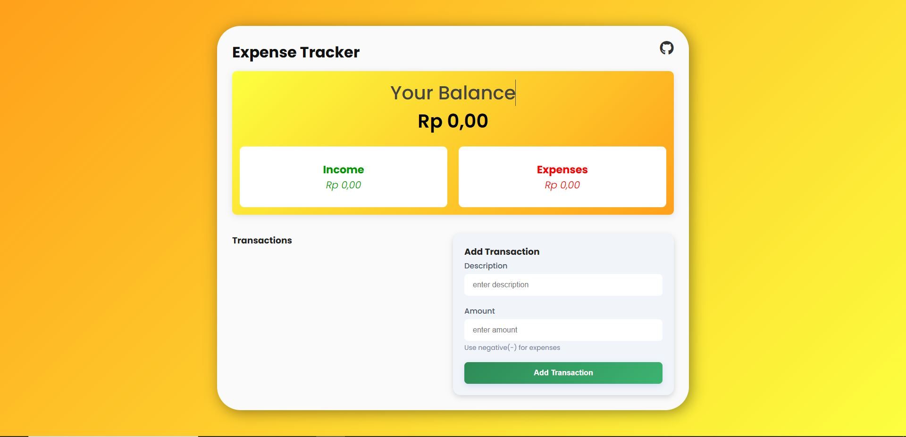
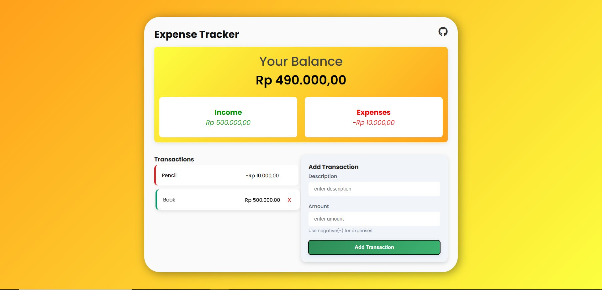

# Expense Tracker

# 💸 Expense Tracker

A simple and stylish Expense Tracker web application that allows you to manage your income and expenses. Add, delete, and track your transactions in real-time, with all data saved locally in your browser.


## 🔗 Live Demo

You can try the live demo here: [https://expense-tracker-xi-five-66.vercel.app/](https://expense-tracker-xi-five-66.vercel.app/)

---

## ✨ Features

- Add income and expense transactions
- Display current balance, total income, and total expenses
- Delete transactions
- Animations and hover effects
- Responsive design
- Stores data in `localStorage` (no backend required)

---

## 🛠️ Technologies Used

  
- LocalStorage API

---


## 🚀 Getting Started

To run this project locally:

1. Clone this repository:
   ```bash
   git clone https://github.com/MuhWildanA/expense-tracker.git
   cd expense-tracker
2. open index.html

---

## Deployment
You can deploy this app to platforms like:

  

⚠️ This app uses localStorage, so data will only persist per browser and device.

---

## 📌 Notes
This app does not use a database. If you want persistent, multi-user data, consider adding a backend (Node.js, Firebase, Supabase, etc.).

Income is any amount > 0.
Expense is any amount < 0.

---

## 📸 Screenshots



---

## 🎥 Inspiration
I built this project by following a tutorial on YouTube that explained how to create an expense tracker using HTML, CSS, and JavaScript. The tutorial helped me learn about DOM manipulation, data persistence with localStorage, and basic state handling in front-end development.

📺 YouTube Tutorial Link: https://youtu.be/kAiX0itnonM?si=o-tt_OEHC2NXhFpj

Feel free to check out the video if you're learning JavaScript or want to build a similar project!